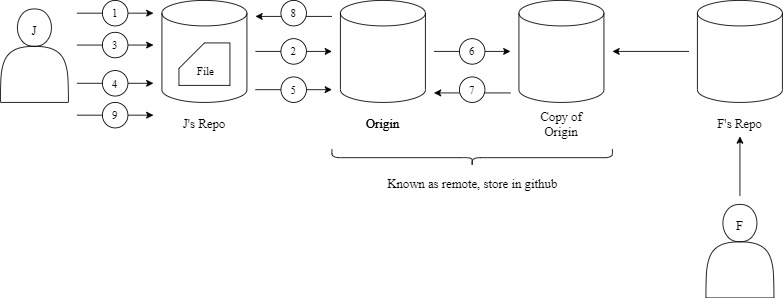
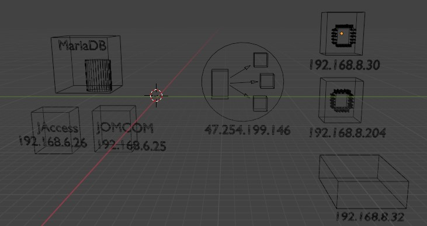
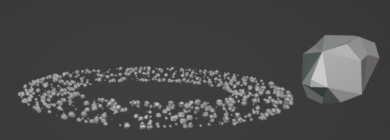
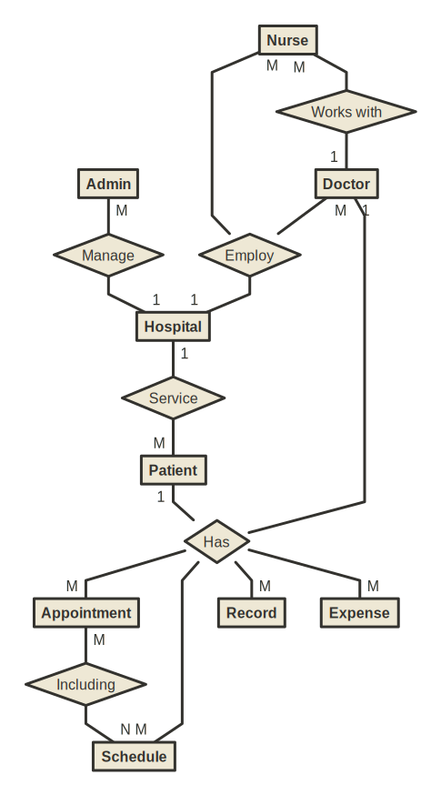
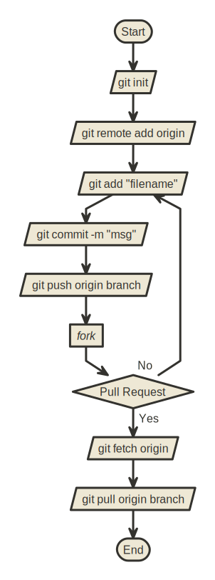
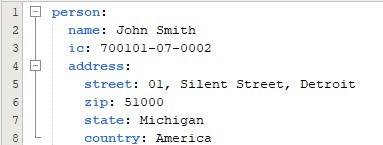
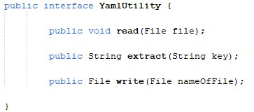
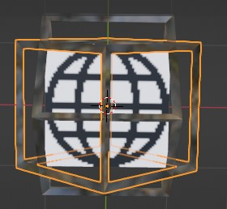

title: Internship Presentation
author:
  name: Jason Wong
  url: https://github.com/jaosn0412
style: basic-style.css
output: presentation-cleaver.html

---

# Internship for Digital Business

## MIDF 2022-2023

---

# Week 1

## 11 October 2022 to 14 October 2022

---

### 11 October 2022

- Setup new laptop provided by GIT
- Installed WSL2 on windows
- Learned about COWSAY commands
- Learned about navigating in linux with terminal commands

---

### 12 October 2022

| Command            | Description                                          | Remarks                          |
| ------------------ | ---------------------------------------------------- | -------------------------------- |
| `shutdown -r -t 5` | restarts the computer after 5 seconds                | this is a windows command        |
| `uname -a`         | prints the system kernel and local machine info      |                                  |
| `apt`              | manage packages available for install in ubuntu      | package manager for Ubuntu       |
| `ip addr`          | prints addesses available for each network interface | another command alike `ifconfig` |

---

### 13 October 2022

- Pull Request:
  – also referred to as a merge request
  – is an event that takes place in software development when a contributor/developer is ready to begin the process of merging new code changes with the main project repository.

---

### 13 October 2022

| Command             | Description                                                                    | Remarks                    |
| ------------------- | ------------------------------------------------------------------------------ | -------------------------- |
| `lsb_release -a`    | Show the version of Ubuntu, release, and codename.                             |                            |
| `cowsay -e TT huhu` | Change the cow’s eye to ‘TT’ and let cow say ‘huhu’.                           | -f : change cow to turtle. |
| `sudo`              | Allows a permitted user to execute a command as the superuser or another user. |                            |
| `man`               | This is a manual to get an explanation.                                        |                            |

---

### 14 October 2022

| Command | Description                                                                    | Remarks                                |
| ------- | ------------------------------------------------------------------------------ | -------------------------------------- |
| `>`     | Copy the output into the file and become contents with replace its contents.   |                                        |
| `>>`    | Copy the output into the file and become contents without change its contents. |                                        |
| `clear` | To clear all the commands in the terminal.                                     |                                        |
| `cat`   | Concatenate files and print on the standard output. by different ways.         | another command alike `less/ more/ vi` |

Vocabulary:
| drwx | d:directory; r:read; w:write; x:execute |

---

# Week 2

## 17 October 2022 - 21 October 2022

---

### 17 October 2022

| Command      | Description                                          | Remarks                                                                                                                |
| ------------ | ---------------------------------------------------- | ---------------------------------------------------------------------------------------------------------------------- |
| `ssh-keygen` | Used to generate public key and private key for SSH. |                                                                                                                        |
| `id_rsa`     | A private key.                                       | The default name for SSH key pairs is id_rsa , and that name will allow an SSH client to locate the key automatically. |
| `id_rsa pub` | A public key.                                        |                                                                                                                        |

---

### 18 October 2022

| Command         | Description                                                    | Remarks                               |
| --------------- | -------------------------------------------------------------- | ------------------------------------- |
| `git status`    | To show the status of each files.                              |                                       |
| `git commit`    | Captures a snapshot of the project's currently staged changes. |                                       |
| `npm install`   | To install dependencies of the project.                        |                                       |
| `npm run debug` | To run the project.                                            | another command alike `npm run start` |

---

### 19 October 2022

#### Step for getting changes from remote:

- 1: git fetch origin
- 2: git pull origin [branch name]

#### Step for pushing changes into remote:

- 1: git status
- 2: git add [file name]
- 3: git commit -m "[commit messages]"
- 4: git push origin [branch name]

---

### GIT workflow

Below is the git workflow

Legend on the next page.

---

### GIT workflow

1. `git init`
2. `git remote add origin`
3. `git add [filename]`
4. `git commit -m "msg"`
5. `git push origin branch`
6. `fork`
7. `Pull Request`
8. `git fetch origin`
9. `git pull origin branch`

---

# Week 3

## 25 October 2022 - 28 October 2022

---

### 27 October 2022

| Command          | Description                                                                                                                                                           | Remarks |
| ---------------- | --------------------------------------------------------------------------------------------------------------------------------------------------------------------- | ------- |
| `git show`       | Used to view expanded details on Git objects such as blobs, trees, tags, and commits.                                                                                 |         |
| `git blame`      | Used to know who is the editor of each line.                                                                                                                          |         |
| `git stash save` | git stash temporarily shelves (or stashes) changes you've made to your working copy so you can work on something else, and then come back and re-apply them later on. |         |

---

### Distributed vs Centralized Version Control

| Distributed                                         |                        | Centralized                                                                       |
| --------------------------------------------------- | ---------------------- | --------------------------------------------------------------------------------- |
| clone/fork                                          | _download terminology_ | checkout                                                                          |
| logs, diffs are stored in each clones               | _storage_              | the logs, diffs are stored in the central server                                  |
| each clones/fork is the full copy of the repository | _downloaded copy_      | each checkout copy is a snapshot of the current version being checked out version |

---

### Distributed vs Centralized Version Control

| Distributed                                                   |                               | Centralized                                           |
| ------------------------------------------------------------- | ----------------------------- | ----------------------------------------------------- |
| branching is promoted and easy to perform                     | _branching_                   | branching is controlled and require proper management |
| each clones/for may or may not be similar between clones/fork | _clones/checkout_             | each checkout conforms to the central version         |
| git, mercurial                                                | _known version control names_ | subversion, cvs, clearcase                            |

---

### Distributed vs Centralized Version Control

---

# Week 4

## 31 October 2022 - 4 November 2022

---

### 31 October 2022

| Command                            | Description                    | Remarks |
| ---------------------------------- | ------------------------------ | ------- |
| `git branch --delete <branchname>` | Used to delete certain branch. |         |
| `git branch <branchname>`          | Used to add a new branch.      |         |

---

### 01 November 2022 - 4 November 2022 (Blender)

| Shortcut Key | Description                   | Remarks                     |
| ------------ | ----------------------------- | --------------------------- |
| `Shift + A`  | Used to add a new object.     | E.g. text, shape, etc       |
| `z`          | Used to change the view mode. | E.g. Wireframe, render, etc |

---

### AWS Cloud

Below is the 3D diagram of AWS Cloud:

---

### Torus

Below is the 3D diagram of Torus:

---

# Week 5

## 7 November 2022 - 11 November 2022 (Nomnoml)

---

### ERD Diagram

Below is the ERD diagram by using Nomnoml:

---

### Git Workflow

Below is the flowchart of Git Workflow:

---

# Week 6

## 14 November 2022 - 17 November 2022

---

### 14 November 2022

| Command            | Description                           | Remarks |
| ------------------ | ------------------------------------- | ------- |
| `cat /etc/passwd ` | User available                        |         |
| `cat /etc/group`   | check groups available in the system. |         |
| `env`              | To print environment variables        |         |
| `apt-get update`   | To update apt packages.               |         |

---

### 15 November 2022

| Command                               | Description                          | Remarks              |
| ------------------------------------- | ------------------------------------ | -------------------- |
| `apt-cache search docker `            | To search packages available in apt  |                      |
| `usermod -aG docker $USER`            | To add user into docker group.       |                      |
| `ps -aux`                             | To check processors.                 | In Windows: tasklist |
| `__ &`                                | To send the process into background. |                      |
| `docker run --rm -it wernight/funbox` | To run the funbox by using docker    |                      |

---

### 16 November 2022

| Command                                        | Description                                                                             | Remarks                                                                  |
| ---------------------------------------------- | --------------------------------------------------------------------------------------- | ------------------------------------------------------------------------ |
| `makedir -pm ~/parentdir/childdir1/childdir2 ` | Stand for parents, meaning that no error if existing, make parent directories as needed | m stand for mode, meaning set file mode (as in chmod), not a=rwx - umask |
| `ug=rwx`                                       | Mean that user and group can read, write, execute                                       |                                                                          |
| `kill 'PID'`                                   | Get the PID from `ps aux`, and kill the process specify process ID.                     |                                                                          |
| `variable`                                     | In Ubuntu : $a; In Windows: %a%                                                         |                                                                          |

---

# Week 7

## 21 November 2022 - 25 November 2022

---

| Command                                      | Description                                       | Remarks                          |
| -------------------------------------------- | ------------------------------------------------- | -------------------------------- |
| `docker container ls`                        | To list out all the items in the container        |                                  |
| `mysql -h 172.17.0.2 -u root -pmy-secret-pw` | To execute the specific database                  | -h: host; -u: user; -p: password |
| `docker inspect [container_name]`            | To heck the location of Docker’s internal volumes |                                  |
| `docker run <put your parameters here>`      | To run specify image by using docker              |                                  |

---

# Week 8 - Week 11

## 28 November 2022 - 23 December 2022 (Jhipster & Docker)

---

### 19 December 2022

#### Step for pushing file into docker:

- 1: docker login -u "username"
- 2: docker tag firstimage YOUR_DOCKERHUB_NAME/firstimage
- 3: docker push YOUR_DOCKERHUB_NAME/firstimage:tagname

---

#### Step for pulling and run the images from docker:

- 1: docker pull YOUR_DOCKERHUB_NAME/firstimage
- 2: docker run -p 8081:8080 YOUR_DOCKERHUB_NAME/firstimage

---

#### Steps for build dockerfile:

- 1: FROM openjdk:latest (Find from docker hub)
- 2: RUN mkdir /opt/jasonfyp
- 3: COPY ./build/libs/jason-fyp-0.0.1-SNAPSHOT.jar /opt/jasonfyp
- 4: CMD java -jar /opt/jasonfyp/jason-fyp-0.0.1-SNAPSHOT.jar

---

# Week 12 - Week 14

## 26 December 2022 - 13 January 2023 (Yaml & Blender)

---

- Yaml:
  – A digestible data serialization language often used to create configuration files with any programming language. Designed for human interaction, YAML is a strict superset of JSON, another data serialization language. But because it's a strict superset, it can do everything that JSON can and more.

---

### Yaml File Sample

Below is the Yaml File Sample by using Netbeans:

---

### Yaml File 

Below is the Yaml File by using Netbeans:

This program is used to perform read, write and extract data from Yaml files. In this project there are three main java files, a test file, a main coding file, and an implementation file.

---

### Internet icon

Below is the Internet icon by using Blender:

---

### More Commands Learned

| Command   | Description                                        | Remarks                                 |
| --------- | -------------------------------------------------- | --------------------------------------- |
| `init`    | Initializer. To set up a new or existing package.  |                                         |
| `history` | List out all the commands inserted before.         |                                         |
| `cd`      | Get into the directory if with the directory name. | If not, then it will back to home page. |
| `git`     | To keep track every changes of the file.           |                                         |

--  
# END
